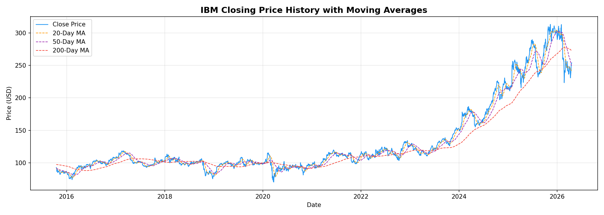
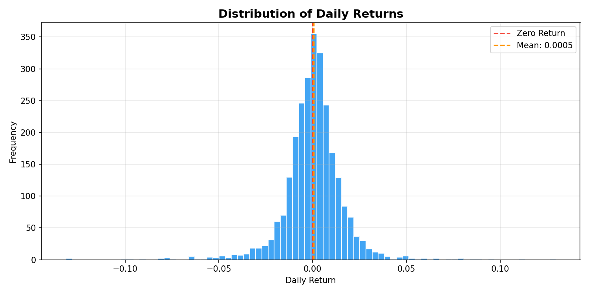
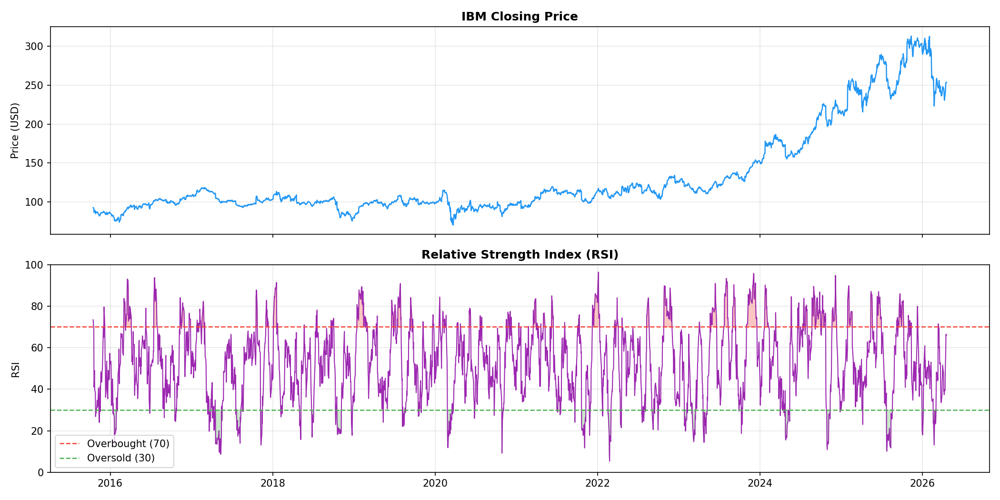
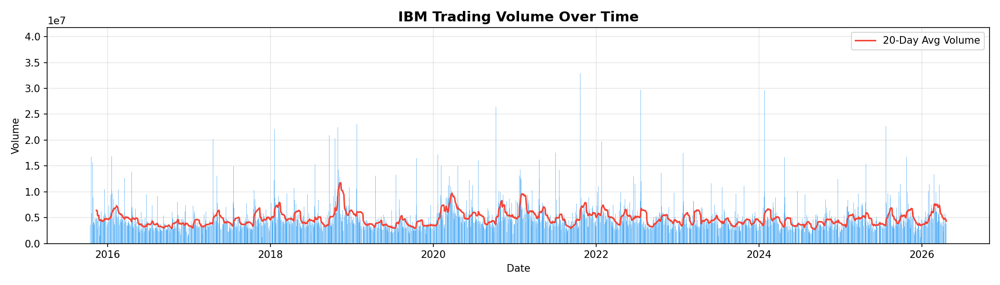
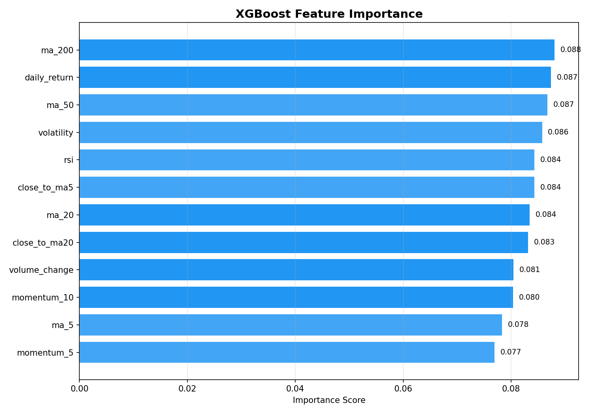
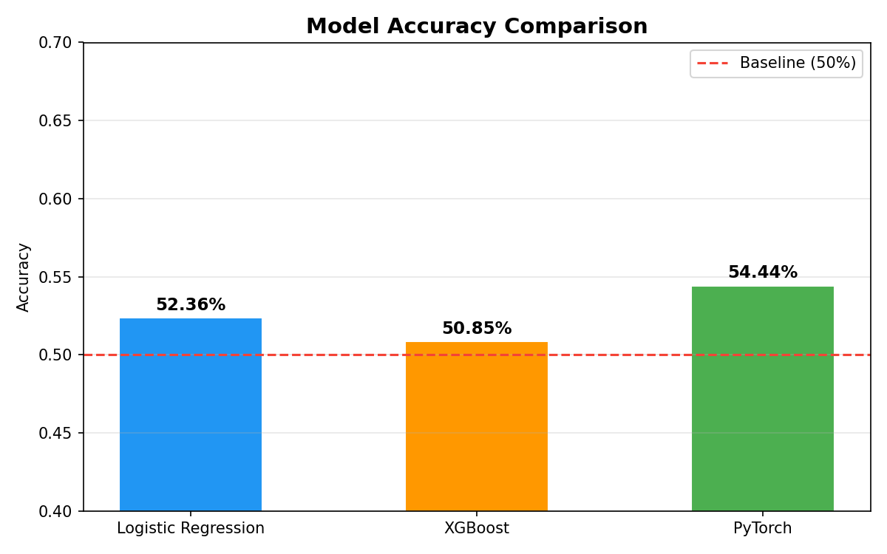

# Stock Market Prediction

A machine learning pipeline that predicts day-to-day IBM stock (or other stock depending on valid symbol) price movement using three models: Logistic Regression, XGBoost, and a PyTorch Neural Network.

---

## Table of Contents
- [Project Overview](#project-overview)
- [File Structure](#file-structure)
- [File Descriptions](#file-descriptions)
- [How to Change the Stock Symbol](#how-to-change-the-stock-symbol)
- [How to Run](#how-to-run)
- [Output](#output)
- [Charts](#charts)
- [Dependencies](#dependencies)

---

## Project Overview

This project implements a machine learning pipeline to predict day-to-day stock market movement. The goal is to classify whether a stock's price will go **up or down** on the next trading day using three different models. The pipeline is broken into six modular Python files, each responsible for a distinct stage of the process.

---

## File Structure

```
stock_prediction_market/
├── data/
│   └── raw_stock_data.csv            # Auto-generated when you run the pipeline
├── results/
│   ├── metrics_YYYYMMDD_HHMMSS.txt  # Auto-generated after each run
│   └── charts/
│       ├── 1_closing_price_history.png
│       ├── 2_daily_returns_distribution.png
│       ├── 3_rsi.png
│       ├── 4_volume.png
│       ├── 5_xgboost_feature_importance.png
│       └── 6_model_accuracy_comparison.png
├── src/
│   ├── main.py                       # Entry point — runs the full pipeline
│   ├── fetch_data.py                 # Downloads stock data from yfinance
│   ├── preprocess.py                 # Cleans and prepares the raw data
│   ├── features.py                   # Engineers features for the models
│   ├── model.py                      # Trains Logistic Regression, XGBoost, PyTorch
│   ├── evaluate.py                   # Evaluates model accuracy and confusion matrix
│   └── visualize.py                  # Generates charts and saves them to results/charts
└── requirements.txt
```

---

## File Descriptions

### fetch_data.py
Responsible for collecting raw stock market data. Using the `yfinance` library, it downloads daily historical stock data from January 1, 2015 up to the current date. The data is automatically saved as a CSV file into the project's `data/` folder. Every time the pipeline runs, it pulls the most up-to-date market data available, ensuring predictions are always based on the latest information. The CSV contains daily Open, High, Low, Close, and Volume values sorted with the most recent dates at the top.

### preprocess.py
Handles loading and cleaning the raw CSV data. It reads the file into a pandas DataFrame, parses the Date column as a datetime index, and selects only the five relevant columns: Open, High, Low, Close, and Volume. Any rows with missing or non-numeric values are dropped. The data is sorted in ascending order by date so that time-series feature calculations are computed correctly.

### features.py
Performs feature engineering — transforming raw price data into meaningful inputs the models can learn from. It computes twelve features for each trading day:

| Feature | Description |
|---|---|
| `daily_return` | Percentage change in closing price day over day |
| `ma_5` | 5-day moving average of closing price |
| `ma_20` | 20-day moving average of closing price |
| `ma_50` | 50-day moving average of closing price |
| `ma_200` | 200-day moving average of closing price |
| `momentum_5` | Price change over the last 5 days |
| `momentum_10` | Price change over the last 10 days |
| `rsi` | Relative Strength Index — measures overbought/oversold conditions |
| `volume_change` | Percentage change in trading volume |
| `close_to_ma5` | Distance of closing price from 5-day moving average |
| `close_to_ma20` | Distance of closing price from 20-day moving average |
| `volatility` | Rolling 5-day standard deviation of daily returns |

The prediction **target** is defined as:
- `1` — Next day's closing price is **higher** than today's
- `0` — Next day's closing price is **lower** than today's

### model.py
Contains the core machine learning logic and trains three models:

**Logistic Regression**
A simple linear baseline model from scikit-learn. It draws a linear boundary between up and down days based on the input features.

**XGBoost**
A gradient boosting model that builds an ensemble of decision trees. More powerful than logistic regression on tabular data and can capture non-linear relationships between features. Configured with:
- 200 estimators
- Max depth of 4
- Learning rate of 0.05
- Subsampling of 80%

**PyTorch Neural Network**
A fully connected neural network with the following architecture:
```
Input (12 features)
      ↓
Linear(64) → ReLU
      ↓
Linear(32) → ReLU
      ↓
Linear(1)  → Sigmoid
      ↓
Output (0 = DOWN, 1 = UP)
```
Trained over 100 epochs using the Adam optimizer and Binary Cross Entropy loss.

All three models are trained on **80%** of the data and tested on the remaining **20%**. Each model also predicts the next trading day's direction using today's most recent data.

### evaluate.py
Evaluates each model using two metrics:
- **Accuracy Score** — Percentage of days where the model correctly predicted market direction
- **Confusion Matrix** — Breaks results into true positives, true negatives, false positives, and false negatives

### main.py
The entry point for the entire pipeline. Orchestrates all files in sequence:

```
fetch_stock_data()
      ↓
load_and_clean_data()
      ↓
add_features()
      ↓
train_model()
      ↓
evaluate_model()
      ↓
Save results + next day prediction
```

After evaluation it automatically determines the next trading day (skipping weekends) and outputs each model's prediction as **UP** or **DOWN**. All results are saved to a timestamped `.txt` file in the `results/` folder.

### visualize.py
Generates six charts from the data and model results and saves them as PNG files to `results/charts/`. Run this after `main.py` to produce the charts.

---

## How to Change the Stock Symbol

By default the pipeline predicts **IBM**. To switch to any other stock, open `fetch_data.py` and change the `SYMBOL` variable at the top of the file:

```python
SYMBOL = "IBM"   # Change this to any valid ticker symbol
```

Examples:

| Company | Symbol |
|---|---|
| Apple | `AAPL` |
| Microsoft | `MSFT` |
| Google | `GOOGL` |
| Amazon | `AMZN` |
| Tesla | `TSLA` |
| S&P 500 ETF | `SPY` |
| NVIDIA | `NVDA` |

For example to predict Apple stock:
```python
SYMBOL = "AAPL"
```

Then delete the existing `data/raw_stock_data.csv` file and re-run the pipeline so it fetches fresh data for the new ticker.

---

## How to Run

**1. Install dependencies:**
```bash
pip install -r requirements.txt
```

**2. Run the pipeline from the repo root:**
```bash
python src/main.py
```

**3. Generate charts:**
```bash
python src/visualize.py
```

**4. Check your results:**
- Accuracy and confusion matrix for each model will print in the terminal
- A full results file will be saved to `results/metrics_YYYYMMDD_HHMMSS.txt`
- Charts will be saved to `results/charts/`

---

## Output

After running, the terminal will display something like:

```
Logistic Regression Accuracy: 0.5312
XGBoost Accuracy:              0.5587
PyTorch Accuracy:              0.5401

-- Next Trading Day Prediction: 2026-04-21 --
Logistic Regression: UP ^
XGBoost:             UP ^
PyTorch:             DOWN v
```

> **Note:** Stock market prediction is inherently difficult. An accuracy above 53-55% is considered meaningful for next-day direction prediction. These models are for educational purposes and should not be used for real financial decisions.

---

## Charts

After running `visualize.py` the following charts will be saved to `results/charts/`:

| Chart | Description |
|---|---|
| `1_closing_price_history.png` | IBM price over time with moving averages overlaid |
| `2_daily_returns_distribution.png` | Histogram of how much the stock moves each day |
| `3_rsi.png` | RSI indicator showing overbought/oversold conditions |
| `4_volume.png` | Trading volume over time with 20-day average |
| `5_xgboost_feature_importance.png` | Which features XGBoost relies on most |
| `6_model_accuracy_comparison.png` | Side by side accuracy of all three models vs the 50% baseline |








---

## Dependencies

| Library | Purpose |
|---|---|
| `yfinance` | Download historical stock data |
| `pandas` | Data manipulation and cleaning |
| `scikit-learn` | Logistic Regression, scaling, evaluation |
| `xgboost` | Gradient boosting model |
| `torch` | PyTorch neural network |
| `matplotlib` | Generate charts and visualizations |
| `numpy` | Numerical computations |